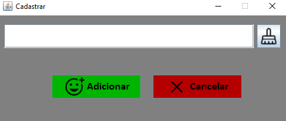
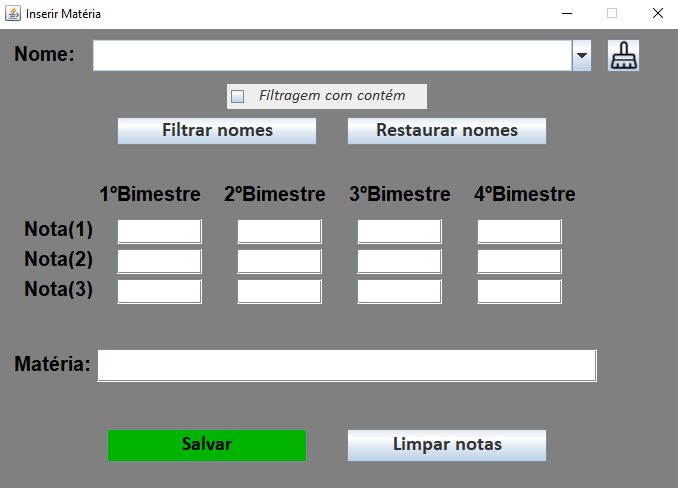
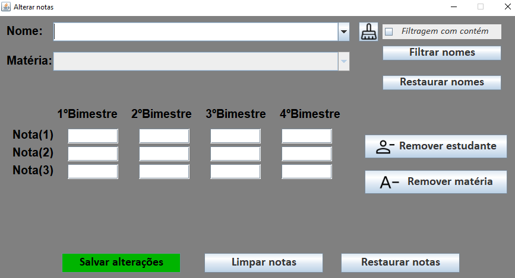
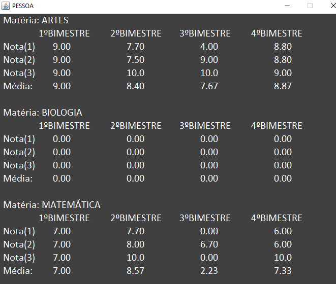

# Projeto - gerenciamento de estudantes

> Status do Projeto: :heavy_check_mark: (concluido)

### Tópicos 

:small_blue_diamond: [Descrição do projeto](#descrição-do-projeto)

:small_blue_diamond: [Funcionalidades](#funcionalidades)

:small_blue_diamond: [Pré-requisitos](#pré-requisitos)

## Descrição do projeto 

  Sistema de gerenciamento de estudantes de uma escola. Seu objetivo é otimizar e gerenciar de forma eficaz as notas das disciplinas cadastradas
  de cada estudante. Possui uma interface intuitiva e de fácil manipulação.
  Seu foco são as instituições de ensino e os próprios alunos que podem utilizá-la.
  
  A forma de armazenamento dos dados é em arquivos txt, facilitando desse modo, a utilização de forma offline.

## Funcionalidades

:heavy_check_mark: Cadastrar estudantes

:heavy_check_mark: Adicionar disciplinas

:heavy_check_mark: Alterar dados / excluir

:heavy_check_mark: Visualizar histórico

## Pré-requisitos

- :warning: Java - o usuário deverá ter o java instalado em sua máquina

## Como utilizar?
Na pasta -dist- está o executável .jar
